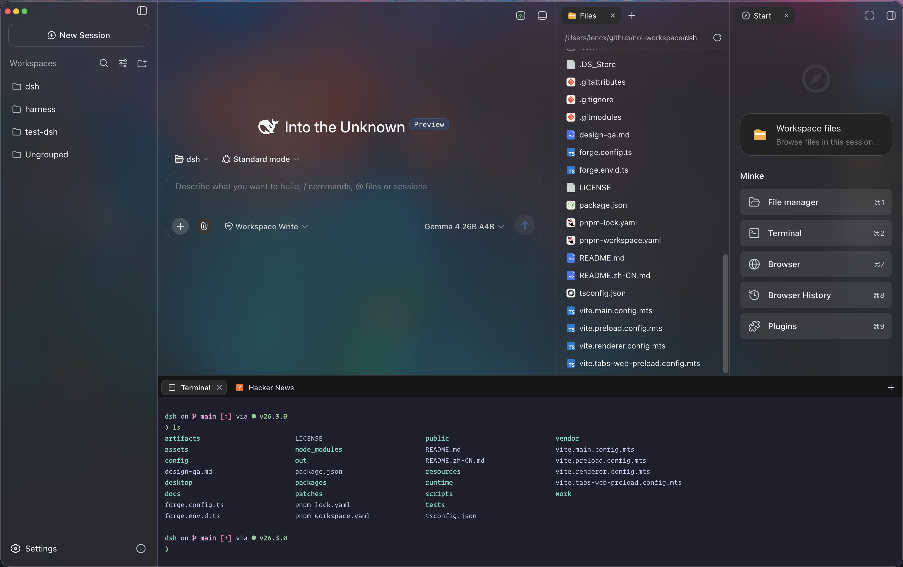
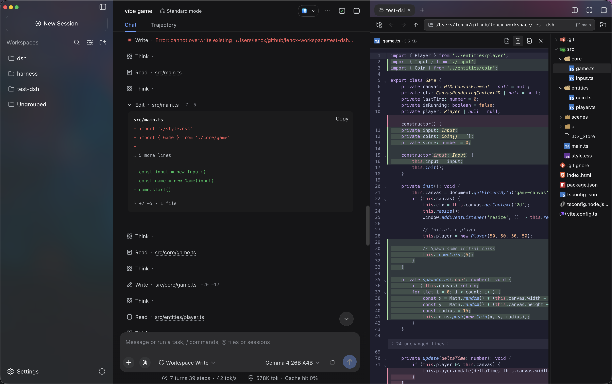
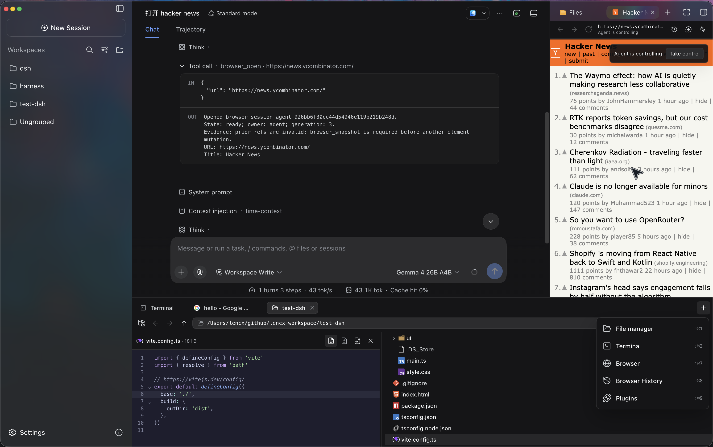
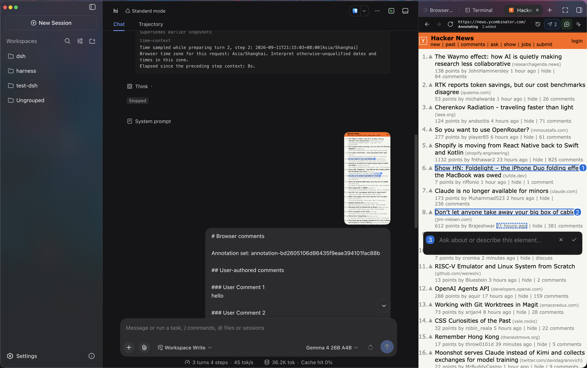
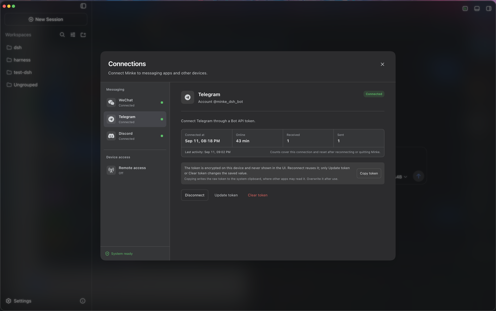
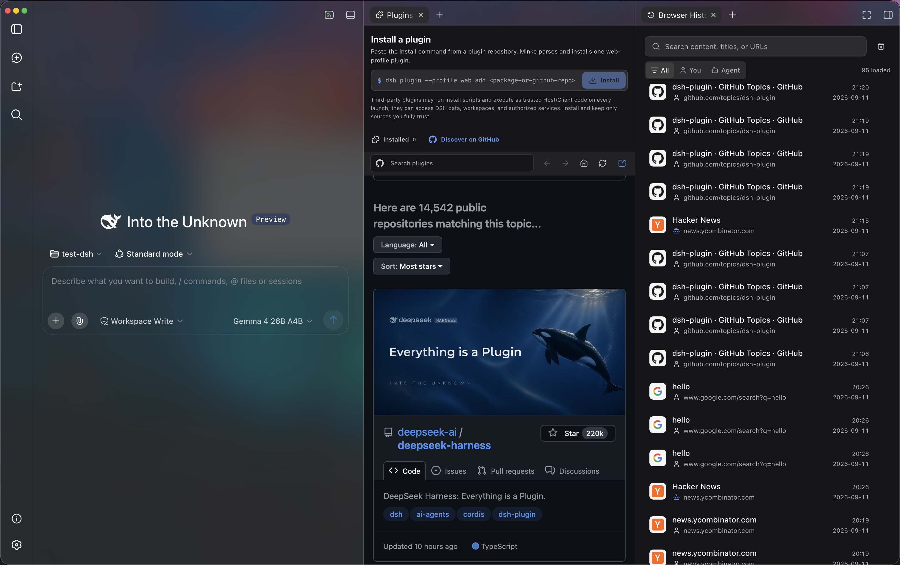

<p align="center">
  
</p>

<h1 align="center">Minke</h1>

<p align="center">
  <strong>A local-first desktop agent workspace powered by DeepSeek Harness</strong>
</p>

<p align="center">
  English · <a href="./README.zh-CN.md">简体中文</a>
</p>

<p align="center">
  <a href="https://github.com/lencx/Minke/releases"></a>
  <a href="https://discord.gg/XMX5BEX8K"></a>
  <a href="https://x.com/lencx_"></a>
  <a href="https://www.buymeacoffee.com/lencx"></a>
</p>

Minke is a local-first desktop agent workspace powered by [DeepSeek Harness](https://github.com/deepseek-ai/deepseek-harness). Work with an agent across conversations, project files, terminals, and visible browser tabs. Take over a page when needed, review and edit the resulting files, or access your workspace from another device.

> [!IMPORTANT]
> Minke is under active development. Features, packaging, and the local data schema may change as the project evolves. This README describes the current source; packaged releases may differ. Minke is an independent community project, not an official DeepSeek product.

## Highlights

Minke builds on Harness's agent capabilities with shared browser control, an integrated desktop workspace, remote access, and local model management.

- **Agent Browser with shared control** — Agents can search, open, and interact with the Web in visible browser tabs. Take control of a live tab without closing it, hand it back when ready, or send annotated page context to the conversation.
- **Flexible workspace and file editing** — Arrange Files, Terminal, Web, Browser History, and Plugins beside the conversation using Harness's split, floating, and fullscreen sidebar tabs, plus Minke's independent bottom panel. Edit source, review diffs, and preview Markdown and HTML drafts in place.
- **Agent workflows and conversation history** — Use Harness's Agent Presets, planning, goals, skills, and subagents. Navigate long conversations through the turn outline, jump to earlier turns, export session logs, and ask the agent to schedule follow-ups in the conversation.
- **Remote access where you already work** — Open your workspace from a phone or another computer through a responsive Web client with PWA support, or use WeChat, Telegram, and Discord to run tasks on the Minke computer. Private Web access supports Tailscale and Cloudflare Access.
- **Cloud and local models** — Use Harness's model providers and custom endpoints, with Minke's model discovery and optional service auto-start for LM Studio and Ollama. Other loopback OpenAI-compatible services can be configured manually.
- **Plugins with visible runtime status** — Discover and install Harness plugins, enable or disable them, and see whether they are running, loading, or failed. Safe mode helps troubleshoot startup while preserving installed plugins.
- **Desktop integration and local storage** — macOS, Windows, and Linux builds provide native menus, customizable shortcuts, built-in updates, synchronized themes, and English and Chinese UI. Sessions, settings, Browser History, and browser session data remain on your machine.

<table>
  <tr>
    <td width="50%"></td>
    <td width="50%"></td>
  </tr>
  <tr>
    <td width="50%"></td>
    <td width="50%"></td>
  </tr>
  <tr>
    <td width="50%"></td>
    <td width="50%"></td>
  </tr>
</table>

## Remote access from another device

Minke remote access is a responsive Web client backed by Minke Host—not a
video stream or touch-controlled projection of the Electron window. From a
phone you can continue conversations, start agent tasks, manage project files,
and use a terminal that runs on the Minke computer.


> [!NOTE]
> **Tailscale Serve over HTTPS**, **Tailscale Direct IP**, and
> **Cloudflare Access** have all completed end-to-end regression testing and
> are currently available.

- **Tailscale Serve over HTTPS (recommended)** — Best for devices already joined to the same tailnet. It provides a secure HTTPS address and supports PWA installation.
- **Tailscale Direct IP (advanced)** — Binds only to the current device's Tailscale IPv4. Traffic remains end-to-end encrypted by Tailscale, but the address uses HTTP and is not a browser secure context.
- **Cloudflare Access** — Exposes a named tunnel protected by an identity policy, without requiring Tailscale on the phone. It requires a configured Cloudflare Tunnel, Access application, and an explicit allow policy.

### Recommended setup: Tailscale Serve

Minke can expose its Web UI privately through [Tailscale Serve](https://tailscale.com/docs/reference/tailscale-cli/serve). It keeps Harness on the local loopback address, does not bind it to the LAN, and does not enable the public Tailscale Funnel.

1. Install Tailscale on the Minke computer and the phone, sign both into the
   same tailnet, and confirm the computer is connected.
2. In Minke, open **Connections → Device access → Remote access**, select
   **HTTPS Serve**, and enable remote access. Minke connects in the
   background; no restart is required.
3. Copy or open the displayed
   `https://…ts.net` address on the phone.

### Install as a PWA

Open a Tailscale Serve or Cloudflare Access HTTPS address, choose
**Install Minke** in the sidebar, and accept the browser install prompt. On
iPhone or iPad, use **Share → Add to Home Screen**. The installed app launches
in standalone mode; when connectivity is poor it shows connection or offline
feedback instead of silently presenting cached workspace content.

Minke activates only one remote route at a time, owns its foreground proxy
while the app is running, and stops it on exit. The remote page can start
agent tasks and use local tools already authorized in Minke, so grant access
only to trusted tailnet members or Cloudflare Access identities.

## Installation

Download Minke only from the official [GitHub Releases](https://github.com/lencx/Minke/releases) page. The links below always point to the latest stable release.

| Platform | Architecture | Package |
| --- | --- | --- |
| macOS | Apple Silicon (`arm64`) | [Download `.dmg`](https://github.com/lencx/Minke/releases/latest/download/Minke-macos-arm64.dmg) |
| macOS | Intel (`x64`) | [Download `.dmg`](https://github.com/lencx/Minke/releases/latest/download/Minke-macos-x64.dmg) |
| Windows | `x64` | [Download `.exe`](https://github.com/lencx/Minke/releases/latest/download/Minke-windows-x64.exe) |
| Linux | Debian / Ubuntu (`x64`) | [Download `.deb`](https://github.com/lencx/Minke/releases/latest/download/Minke-linux-x64.deb) |
| Linux | Fedora / RHEL (`x64`) | [Download `.rpm`](https://github.com/lencx/Minke/releases/latest/download/Minke-linux-x64.rpm) |
| Linux | `x64` (portable AppImage) | [Download `.AppImage`](https://github.com/lencx/Minke/releases/latest/download/Minke-linux-x64.AppImage) |

Release checksums are available in [`SHA256SUMS`](https://github.com/lencx/Minke/releases/latest/download/SHA256SUMS).

Packaged macOS, Windows, and Linux builds check for stable updates
automatically. Minke selects the fixed DMG, EXE, DEB, RPM, or AppImage asset
for the running system, verifies the immutable GitHub Release, URL chain,
exact size, SHA-256 digest, and available OS provenance marker, then asks
before opening it. Disable background downloads under
**Settings → Minke → Preferences → Software updates** to require a
**Download update** confirmation first, or use **About Minke → Check for
updates** at any time. Installation always remains explicit. See
[desktop application updates](./docs/app-updates.md) for the user flow and
platform behavior.

### macOS

1. Download the `.dmg` file and open it.
2. Drag `Minke.app` into the Applications folder.
3. Current pre-release builds are not notarized. First try Apple's [Open Anyway](https://support.apple.com/en-us/102445) flow under **System Settings → Privacy & Security**.
4. If you explicitly accept the risk and the system flow is unavailable, remove quarantine only from the exact installed app:

   ```bash
   xattr -dr com.apple.quarantine "/Applications/Minke.app"
   ```

5. Open Minke from the Applications folder.

> [!CAUTION]
> Removing the quarantine attribute bypasses a macOS security check. Minke's updater never runs this command automatically. Use it only as a last resort for `Minke.app` downloaded from the official Releases page, and never replace the path with a broad directory.

#### Authorize credential storage on macOS

Minke requests Keychain access only after you open **Connections** and click
**Authorize credential access**. If macOS prompts, enter your Mac login
password and choose **Always Allow**. If access is denied, click **Request
authorization again**.

If credential storage remains unavailable, one possible cause is an invalid or
modified app signature that prevents macOS from recognizing Minke's Keychain
identity. Verify the application:

```bash
codesign --verify --deep --strict --verbose=2 "/Applications/Minke.app"
```

If verification fails for an older pre-release build that you trust and
reinstalling is not practical, quit Minke completely, then repair and reopen
it:

```bash
/usr/bin/codesign --force --deep --sign - --timestamp=none "/Applications/Minke.app" \
  && /usr/bin/codesign --verify --deep --strict --verbose=2 "/Applications/Minke.app" \
  && /usr/bin/open "/Applications/Minke.app"
```

> [!WARNING]
> Re-signing replaces the installed app's signature. Do not run this command
> on a valid Developer ID-signed and notarized release; reinstall the official
> build instead. Do not delete `~/.minke/secrets` or the Minke Safe Storage
> item because existing channel credentials depend on them.

### Windows

1. Download the Windows x64 `.exe` installer.
2. Run the installer and follow the on-screen instructions.
3. Windows may show a reputation-based warning for a new pre-release build. Continue only after confirming that the installer came from the official Minke Releases page.

### Linux

Download the package for your distribution, then open it with your graphical package manager or install it from a terminal.

Debian / Ubuntu:

```bash
sudo apt install "/path/to/minke-package.deb"
```

Fedora / RHEL:

```bash
sudo dnf install "/path/to/minke-package.rpm"
```

Replace the example path with the downloaded package path.

## Build from source

Build Minke on the same operating system and CPU architecture as the package you need. The build produces distributables for the current host under `out/make`; this project does not support cross-platform packaging from a single host.

The bundled Harness version, source commit, and applied patches are recorded in the [runtime configuration](./config/harness-runtime.json).

Prerequisites:

- Git with submodule support. The `vendor/deepseek-harness` submodule must be checked out.
- Node.js 24 or newer.
- pnpm 11.7.0, with the repository dependencies installed before running the scripts.
- macOS: an Apple Silicon or Intel Mac with Xcode Command Line Tools. The `.dmg` target can only be built on macOS.
- Windows: a Windows x64 host. Visual Studio 2022 Build Tools with the **Desktop development with C++** workload may be needed if a native dependency must be compiled locally.
- Linux: a Linux x64 host with a native build toolchain, `fakeroot`, `dpkg`, and either `rpm` or `rpm-build`.

On a fresh checkout, first install the repository dependencies, then prepare the Harness runtime:

```bash
pnpm run harness:stage
```

This command installs and builds the pinned DeepSeek Harness source, then stages the reusable desktop runtime under `runtime/host`. Run it after a fresh checkout, or whenever the pinned Harness source or runtime contract changes.

Start Minke in development mode with:

```bash
pnpm start
```

`pnpm start` refreshes the Minke integration in the prepared runtime and launches the development app.

Create the distributable package for the current platform with:

```bash
pnpm make
```

`pnpm make` performs a full runtime stage again before writing the platform package to `out/make`.

macOS Keychain identifies an app by its code signature. The default local
package uses an ad-hoc signature and may be treated as a new app whenever its
contents change; stable authorization across versions requires the same valid
signing certificate. Find an installed identity with
`security find-identity -v -p codesigning`, then provide it to the packaging
process:

```bash
MINKE_MACOS_SIGN_IDENTITY="Developer ID Application: …" pnpm make
```

Set `MINKE_MACOS_SIGN_KEYCHAIN` as well when CI uses a dedicated keychain.
Never commit the certificate private key or keychain password.

## 中国用户

如在使用中遇到问题，或希望进一步交流 Minke，可关注公众号「浮之静」，发送 `dsh` 获取进群码。也欢迎大家贡献 PR 或分享给更多朋友，您的每一次 Star 都是对开源项目的巨大支持，感恩。

<p>
  
  
  
</p>
